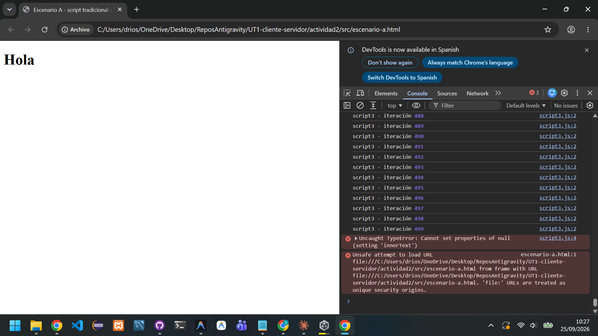
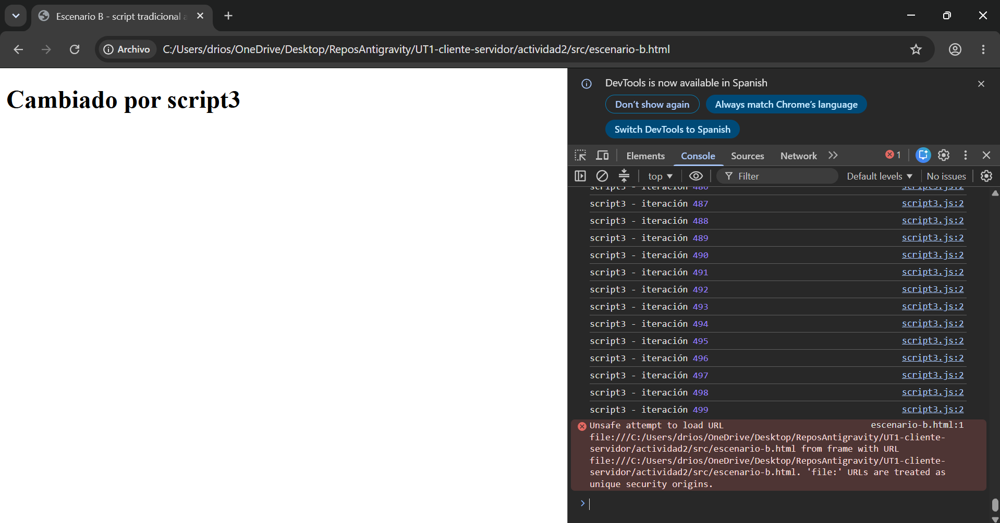
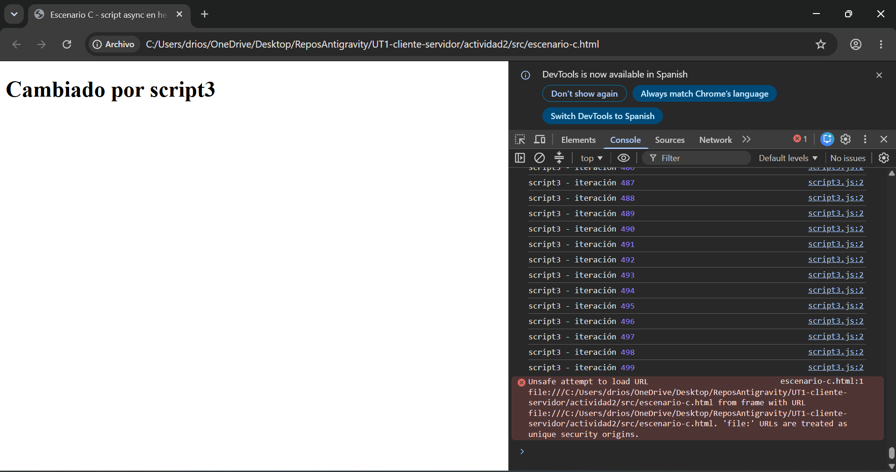
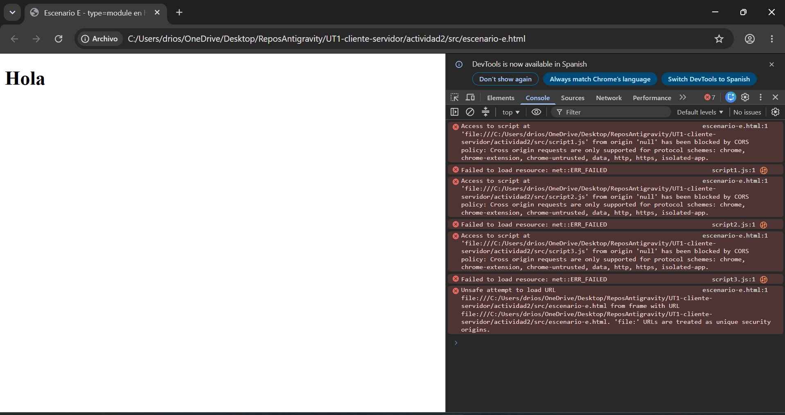

# Informe Técnico — Integración de JavaScript en HTML (defer vs async vs modules)

**Entorno:** `index.html` (idéntico al Escenario B) + `script1.js`, `script2.js`, `script3.js`, cada uno con un bucle de 500 iteraciones (`console.log` en cada una) y luego `document.getElementById('titulo').innerText = 'Cambiado por scriptX'`.

---

## Escenario A — `<script>` tradicional en `<head>`

**Resultado:** el `<h1>` se queda en "Hola" (sin cambios). La consola muestra 3 errores idénticos: `Uncaught TypeError: Cannot set properties of null (setting 'innerText')`.

Los scripts, al estar en el `<head>` sin `async`/`defer`, se ejecutan de forma síncrona y bloqueante en cuanto el parser los encuentra — antes de que el `<body>` (y por tanto el `<h1>`) exista en el DOM. Cada script completa su bucle de 500 `console.log`, pero falla al intentar modificar un elemento que todavía no existe.

## Escenario B — `<script>` tradicional antes de `</body>`

**Resultado:** `<h1>` → "Cambiado por script3". Sin errores.

Al estar los scripts al final del `<body>`, el `<h1>` ya existe cuando se ejecutan. Corren en orden estricto (script1 → script2 → script3), cada uno bloqueando el hilo principal hasta terminar; cada uno sobrescribe el resultado del anterior, así que se queda el del último en ejecutarse.

## Escenario C — `<script async>` en `<head>`

**Resultado:** `<h1>` → "Cambiado por script3". Sin errores.

Con `async`, el parseo del HTML no se detiene para esperar la descarga del script: sigue construyendo el DOM (incluido el `<h1>`) en paralelo. Cada script se ejecuta en cuanto termina de descargarse, sin bloquear el parseo. A diferencia de `defer`, el **orden de ejecución no está garantizado** — depende de qué script termine de descargar antes, no del orden en que aparecen en el HTML.

## Escenario D — `<script defer>` en `<head>`

**Resultado:** `<h1>` → "Cambiado por script3". Sin errores.

Igual que `async`, no bloquea el parseo del HTML. La diferencia es que `defer` sí **garantiza** el orden de ejecución (siempre script1 → script2 → script3) y siempre se ejecuta después de que el DOM esté completo, justo antes del evento `DOMContentLoaded`.

## Escenario E — `<script type="module">` en `<head>`

**Resultado:** `<h1>` se queda en "Hola". La consola muestra errores de CORS en los tres scripts: `Access to script at 'file:///...' from origin 'null' has been blocked by CORS policy`.

Los módulos ES6 se cargan siempre bajo las reglas CORS, igual que una petición `fetch`, y el protocolo `file://` no tiene un origen válido para esa comprobación — por eso fallan al abrir el archivo directamente y necesitan servirse desde un servidor real (http/https), incluso en local. Esta es una particularidad propia de los módulos frente al JavaScript "clásico" global, que sí se puede cargar sin restricciones desde `file://`.

Además, aunque aquí no se ha podido comprobar la ejecución (por el bloqueo de CORS), cabe señalar que un `<script type="module">` se comporta como `defer` por defecto: no bloquea el parseo y se ejecuta en orden tras completarse el DOM. La diferencia adicional es que cada módulo tiene su **propio ámbito** (scope): las variables declaradas en un módulo no contaminan el objeto global `window`, a diferencia de los scripts tradicionales.

---

## Conclusión comparativa

| Escenario | ¿Bloquea el parseo? | ¿Orden garantizado? | Resultado |
|---|---|---|---|
| A — head tradicional | Sí | Sí | Falla (DOM no construido) |
| B — antes de `</body>` | Sí (pero al final, no afecta al render previo) | Sí | Funciona |
| C — async | No | No | Funciona (en este caso) |
| D — defer | No | Sí | Funciona |
| E — module | No (comportamiento tipo defer) | Sí | Falla por CORS en `file://` |
